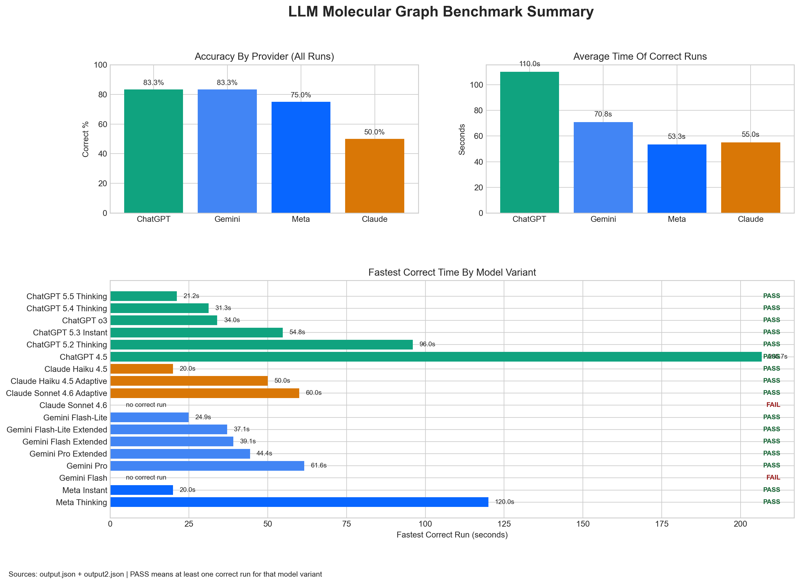

# chem-classifier
Purpose - Build **chemical classifier for rapid conversation screening** by representing and compiling all scheduled chemicals in structural graph form.

Why this matters:

- chemical synthesis pathways are complex
- keyword filtering alone often leads to overmoderation
- chemical nomenclature is difficult and inconsistent across IUPAC names, common names, salts, abbreviations, and minor wording variants
- many model deployments may not have reliable access to external chemistry databases during inference, so the classifier should not depend on live database lookup
- a structural representation should allow faster and more precise chemistry checks
- this may reduce keyword-based overmoderation while still surfacing genuinely risky cases

## Sarin Sample Set

The benchmark below summarizes current timing and correctness results across the tested models using the structure of Sarin and it's derivatives. Across model families, the graph-based Sarin test usually resolved in about 30 seconds for straightforward completions, which matters because it suggests structure screening may be fast enough for practical real-time chemistry checks.



Important note:

- **Claude results in this repo were collected on a free account.**
- the benchmark is included to justify the approach by showing that the graph-based method can work across **multiple model families**, not just a single provider

## TODO

- Full list for OPCW
- Controlled substances
- ATF
- Precursors


```json
{"anthrax":{"aliases":["anthrax","anthrax infection","Bacillus anthracis infection","Bacillus anthracis infections","infection due to Bacillus anthracis","Bacillus anthracis","B anthracis","anthrax bacterium","Bacteridium anthracis","Bacillus cereus var. anthracis","Bacillus cereus variety anthracis","cutaneous anthrax","anthrax skin type","skin anthrax","malignant pustule","inhalation anthrax","inhalational anthrax","pulmonary anthrax","respiratory anthrax","anthrax pneumonia","pneumonia with anthrax","wool sorter's disease","gastrointestinal anthrax","injection anthrax","Black Baine","malignant edema","ragpicker's disease","Siberian plague","splenic fever","charbon","Milzbrand"],"identifiers":["MeSH D000881","MedGen C0003175","MedGen UID 8110","MONDO:0005119","SNOMED CT 409498004","NCBI Taxonomy 1392"]},"sarin":{"aliases":["sarin","GB","Gas Sarin","Sarin II","Trilone 46","IMPF","MFI","O-isopropyl methylphosphonofluoridate","isopropyl methylphosphonofluoridate","o-isopropylmethyl phosphonofluoridate","ortho-isopropylmethyl phosphonofluoridate","isopropoxymethylphosphoryl fluoride","isopropyl methanefluorophosphonate","isopropyl methylfluorophosphate","isopropyl methylfluorophosphonate","1-methylethyl methylphosphonofluoridate","methylfluorophosphoric acid isopropyl ester","methylphosphonofluoridic acid isopropyl ester","phosphonofluoridic acid methyl- isopropyl ester","phosphonofluoridic acid methyl- 1-methylethyl ester","phosphoric acid methylfluoro- isopropyl ester","phosphine oxide fluoroisopropoxymethyl-","2-[fluoro(methyl)phosphoryl]oxypropane","2-(fluoro(methyl)phosphoryl)oxypropane","EA 1208","T-144","T144","T-2106","T2106","TL 1618"],"identifiers":["C4H10FO2P","MW 140.09 g/mol","CAS 107-44-8","CAS 102490-54-0","CAS 50642-23-4","PubChem CID 7871","UNII B4XG72QGFM","ChEBI CHEBI:75873","ChEMBL CHEMBL509554","DSSTox DTXSID0042371","HMDB HMDB0257497","NCI Thesaurus C161526","UN 2810","RTECS TA8400000","InChI=1S/C4H10FO2P/c1-4(2)7-8(3,5)6/h4H,1-3H3","InChIKey DYAHQFWOVKZOOW-UHFFFAOYSA-N","SMILES CC(C)OP(=O)(C)F"]}}
```

</details>
